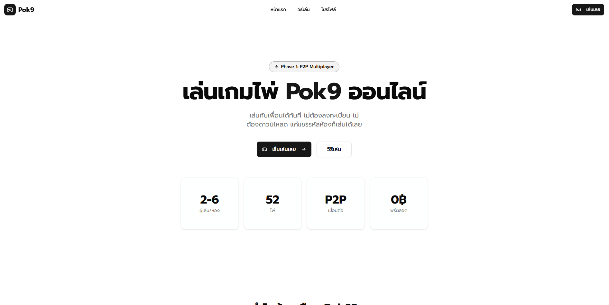

<div align="center">

# ♠️ PokDeng P2P Web

**A modern, real-time multiplayer Pok Deng card game running directly in your browser.**  
*Built with Next.js, PeerJS (WebRTC), and Tailwind CSS.*

[](https://nextjs.org/)
[](https://peerjs.com/)
[](https://tailwindcss.com/)
[](https://www.typescriptlang.org/)

</div>

---



## ✨ Features

Experience the classic Thai card game with modern web technologies.

### 🎮 Gameplay & Mechanics
- **🔌 Serverless P2P:** Host and join games directly without a central game server using WebRTC.
- **🃏 Real-time Sync:** Instant game state synchronization across all players.
- **🤖 Smart Logic:** Automatic score calculation, Pok 8/9 detection, and winner determination.
- **💰 Betting System:** Integrated betting and balance tracking system.
- **🔄 Game Flow:** Smooth turn-based system (Dealer vs Players) with "Draw" or "Stand" actions.

### 🎨 User Interface & Experience
- **🌗 Immersive Design:** Classic green table aesthetic with responsive card animations.
- **📱 Mobile First:** Fully responsive design that works great on desktop and mobile devices.
- **💬 In-Game Chat:** Real-time messaging system to communicate with other players.
- **🔊 Sound Effects:** (Optional) Toggleable sound effects for game actions.
- **👤 Custom Profiles:** Generate random avatars and player names automatically.

---

## 🏆 Hand Rankings

The game automatically calculates scores and detects special hand types based on standard Pok Deng rules.

| Hand Type | Description | Multiplier |
| :--- | :--- | :---: |
| **Pok 9** 👑 | Two cards totaling 9 points. (Highest Priority) | x1-x2 |
| **Pok 8** 🥈 | Two cards totaling 8 points. | x1-x2 |
| **Triple** (ตอง) | Three cards of the same rank (e.g., 3-3-3). | x5 |
| **Straight** (เรียง) | Three cards in sequential rank (e.g., 4-5-6). | x3 |
| **Sam Color** (สามสี) | Three cards of the same suit. | x3 |
| **Normal** | Regular sum of points (mod 10). | x1 |

> **Note:** "Pok" hands (8 or 9) are checked instantly after the initial 2 cards are dealt. If the dealer gets Pok, the round ends immediately.

---

## ⚙️ Interactions & Controls

### 🖱️ Game Actions
| Action | Description |
| :--- | :--- |
| **Create Room** | Generate a unique room code to host a new game. |
| **Join Room** | Enter a room code to connect to a host. |
| **Ready** | Toggle your status to let the host know you are ready. |
| **Draw Card** | Take one more card (if you have 2 cards and points are not satisfied). |
| **Stand** | Keep your current hand and end your turn. |
| **Bet** | (Host only/Future update) Adjust betting amount. |

### ⌨️ Host Controls
| Control | Action |
| :--- | :--- |
| **Start Game** | Begins the round when players are ready. |
| **Next Round** | Resets the deck and starts a new hand after a showdown. |
| **Kick Player** | Remove a player from the lobby (Lobby Phase). |

---

## 🚀 Getting Started

Follow these steps to deploy or run the game locally.

### Prerequisites
* **Node.js** (v18.x or later)
* **npm** or **yarn**

### Installation

1. **Clone the repository**
   ```bash
   git clone https://github.com/TiwKill/PokDeng.git
   cd pok_deng
   ```

2. **Install dependencies**
   ```bash
   npm install
   # or
   yarn install
   ```

3. **Run the development server**
   ```bash
   npm run dev
   # or
   yarn dev
   ```

4. **Open your browser**  
   Navigate to [http://localhost:3000](http://localhost:3000) to start playing.

> **Tip:** Open a second browser window or use your phone (on the same Wi-Fi) to test the P2P connection!

---

## 🛠️ Built With

- **[Next.js](https://nextjs.org/)** - The React Framework for the Web
- **[PeerJS](https://peerjs.com/)** - Simple peer-to-peer with WebRTC
- **[Tailwind CSS](https://tailwindcss.com/)** - Utility-first CSS framework
- **[shadcn/ui](https://ui.shadcn.com/)** - Re-usable components built with Radix UI
- **[Lucide React](https://lucide.dev/)** - Beautiful & consistent icons
- **React Context API** - State Management

---

## 📝 Usage Guide

### Hosting a Game
1. Click **"สร้างห้อง"** (Create Room).
2. You will be assigned a **Room Code** (e.g., `AB12CD`).
3. Share this code with your friends.
4. Wait for players to join and press **"Ready"**.
5. Click **"Start Game"** to deal cards.

### Joining a Game
1. Click **"เข้าร่วม"** (Join Room).
2. Enter the **Room Code** provided by the host.
3. Once connected, click the **"Ready"** button.
4. Wait for the host to start the game.

### During the Game
1. The **Dealer** (Host) distributes 2 cards to everyone.
2. Check your points.
3. When it's your turn, choose to **Draw** (take 1 card) or **Stand** (stay).
4. After everyone finishes, the Dealer plays.
5. **Showdown**: Cards are revealed, and winners are calculated against the Dealer.

---

## 👏 Acknowledgments

- **[shadcn/ui](https://ui.shadcn.com/)** for the beautiful UI components.
- **[PeerJS](https://peerjs.com/)** for making WebRTC implementation simple.
- All contributors and testers who helped balance the game logic.

---

<div align="center">

Made with ❤️ by TiwKill

</div>